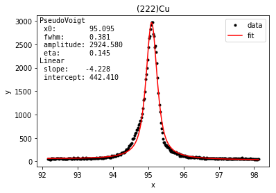

# graph_XRD
scripts to analyse data from X-ray diffraction measurements (theta-2theta, sin2psi, pole figure)

- in particular for PANanlytical diffractomter

- 2theta-theta scan
- sin2 psi
- pole figure